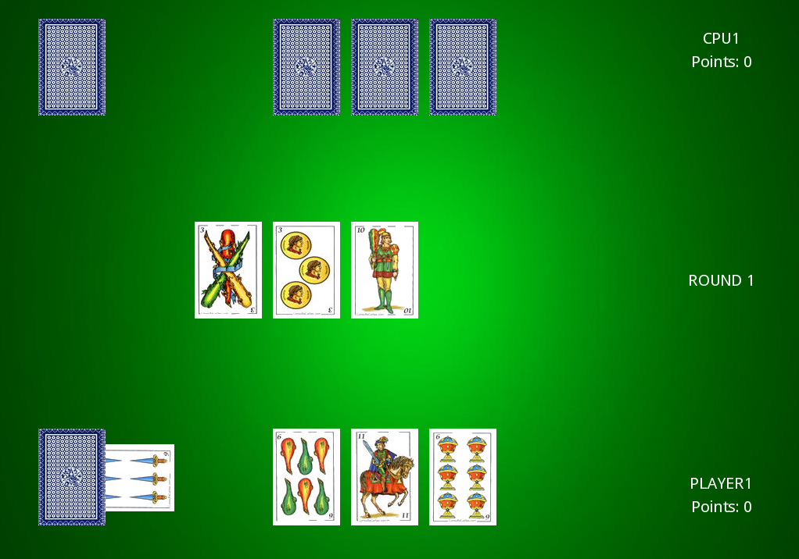

# PyEscoba

Clásico juego de naipes "Escoba de 15" desarrollado en Python. El mismo es totalmente funcional
y puede jugarse desde consola o desde su interface gráfica implementada en PyGameEngine .

Se implementa IA de selección de jugada óptima. La misma calcula la mejor jugada en base
a todas las cartas disponibles.

Si quieres simular una jugada entre 2 IA's, solo tienes que agregar 2 CpuPlayer
(en app.py o app_pygame.py) y ver como juegan entre ellas!

## Ejecución
1. Consola:

    $python app.py

2. PYGAME Engine. Instalar las dependencias en requirements.txt y ejecutar app_pygame.py:

    $pip install -r requirements.txt

    $python app_pygame.py

## Test

   $behave tests/bdd

